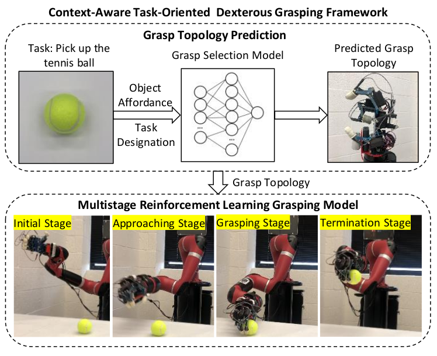
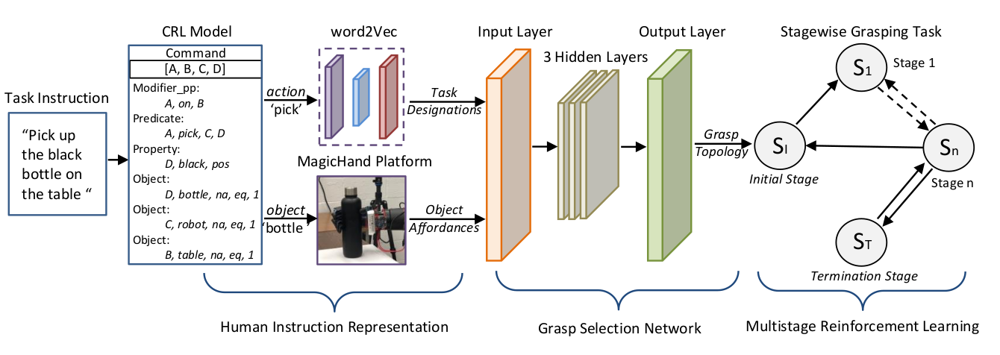
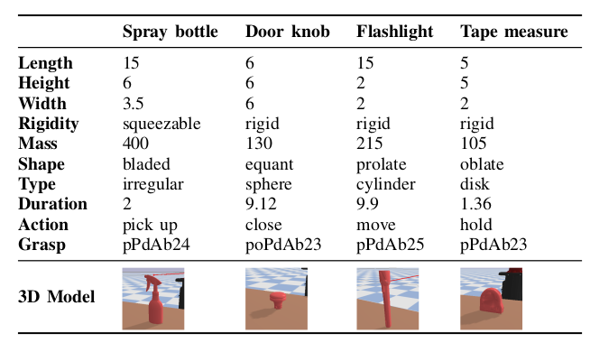
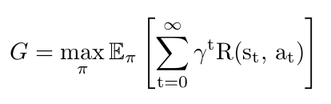
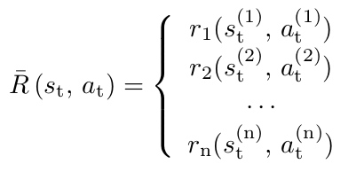
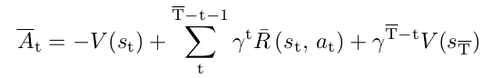
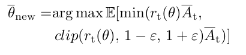
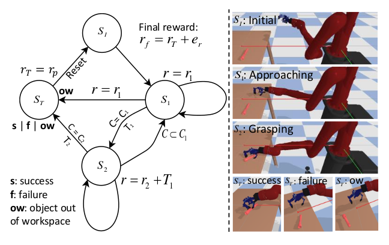
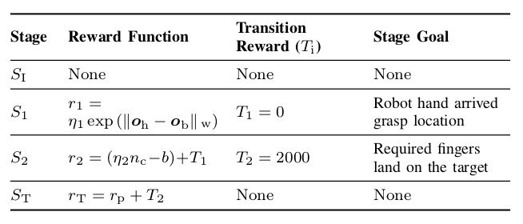
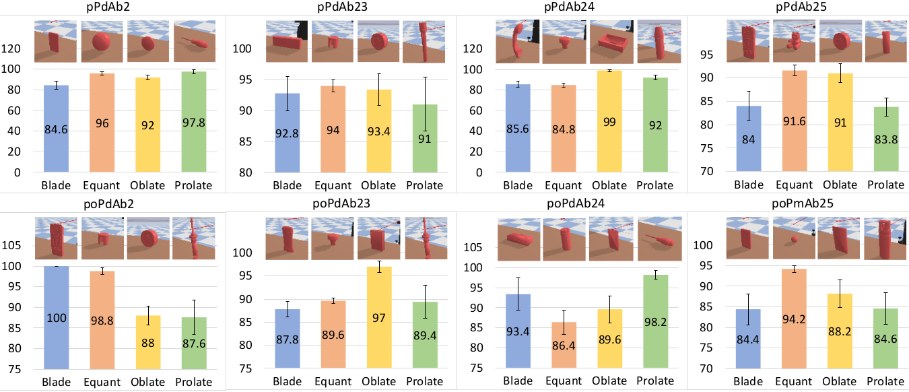

# Context-Aware-Task-Oriented-Grasping-with-Multistage-Reinforcement-Learning

### Concept ####
Perceive object features with multiple sensors attached to the robot arm. Task designations are represented as embeddings extracted from task instructions. Grasp topologies are generated based on object affordance and task designations with a grasp selection network. The predicted grasp topology is deployed adaptively using a multistage reinforcement learning approach.

### Framework ####
Human instructions are parsed with the Controlled Robot Language, and the "action" and "object" are extracted. The "object" identifies the target, and then the object affordances are gathered with the MagicHand Platform. The "action" is processed with word2Vec and embeded as 300 dimensional vector. A multi-label MLP network trained with the task-oriented grasping dataset is desigened to map object affordances and task designations to grasp topologies. The grasping task is decomposed into a series of consecutive sub-tasks and deployed with the multistage reinforcement learning model.

Some example of the task-oriented grasping dataset used in this work is shown below

### Multistage Reinforcement Learning ####
Reinforcement learning is structured with Markov Decision Processes (MDP) that can be presented as a tuple of five components M(S, A, p, R, γ). The goal is to find an optimized policy π that maximizes the return G from every state

For standard reinforcement learning model R is a single funciton provides feedback for an action. In the multistage learning model, we design the reward function as a stage-wise function, each piece corresponding to a stage (sub-task) of the problem

The advance of the proximal policy optimization (PPO) algorithm now can be modeled as 

and the proximal policy optimization algorithm can be expressed as

### Solving a Grasping Task ####

We decompose a grasping task into 4 stages: the initial stage, the approaching stage, the grasping stage, and the termination stage. The initial stage represents the initial configurations of the environment, and every grasping task starts at this stage. In the approaching stage, the robot hand leaves the initial position and approaches the object. Once the robot hand is in the grasp location, the grasping stage begins. In the grasping stage, the movement
of the arm is limited, and the robotic hand starts moving the fingers and attempting to grasp the object. Three possible situations could terminate the current task, thus three possible termination stages. The first situation could happen both in the approaching stage and the grasping stage when the object is out of the workspace. The second and the third termination stages present the result of the grasping which could be either a success or a failure, and can only happen after the grasping stage. After the termination stage, the system will terminate the current task, reset the environment to initial configurations, and start a new grasping task

The stage-wise reward function is modeled as 

The observation space includes norm contact force, distace between the hand and the target, the relative position and orientation
between the hand and the object, and dimensions and shape of the object. Different stages also have different action spaces. In the approaching space the action space include the amount of change of the coordinates of the palm along the x, y, and z axis. In this grasping stage, control of fingers is added to its action space. 

### Experiments ####

#### Grasp results in simulation environment

A total of 16,000 grasping tasks with eight grasp topologies on random unseen objects were proformed in the simulation. The accuracy average accuracy was 90.8%

Video1: https://user-images.githubusercontent.com/63925943/190689219-273b2330-0a52-4491-abc0-b3e3c41b3a93.MP4

#### Real Robot grasping experiments

A total number of 320 grasping tasks were performed and the average success rate achieved 80.6%.

pPdAb2:
https://user-images.githubusercontent.com/63925943/189549416-d3adac0e-6104-445e-84a2-ca788a8df2da.mp4

pPdAb23:
https://user-images.githubusercontent.com/63925943/189549434-44588a96-2d3d-4e1f-8f3f-351b85bac53b.mp4

pPdAb24:
https://user-images.githubusercontent.com/63925943/189549449-a2a4abd0-170e-4860-b86d-39acd7557097.mp4

pPdAb25:
https://user-images.githubusercontent.com/63925943/189549455-5a9a08ef-03f6-47f0-931f-b3ec0edd1af4.mp4

poPdAb2:
https://user-images.githubusercontent.com/63925943/189549473-0a530b5c-9f16-42b9-8aca-8f432467bf73.mp4

poPdAb23:
https://user-images.githubusercontent.com/63925943/189549481-a70b0be6-675f-45af-86ff-1c54baab38af.mp4

poPdAb24:
https://user-images.githubusercontent.com/63925943/189549487-3ab6487c-6a44-4b7f-97f1-c443c14309ed.mp4

poPmAb25:
https://user-images.githubusercontent.com/63925943/189549499-bbea2dcb-2815-4f9d-aa64-e657f353bf41.mp4

