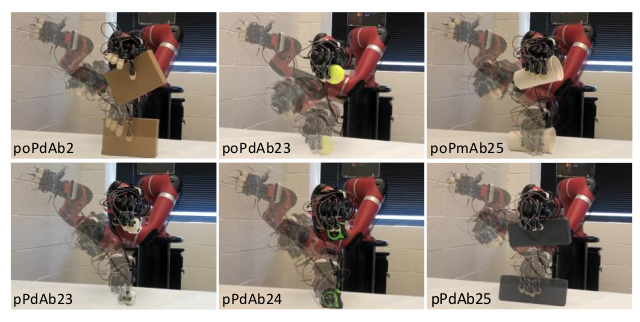
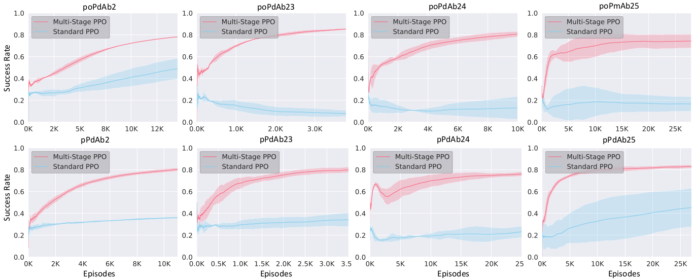
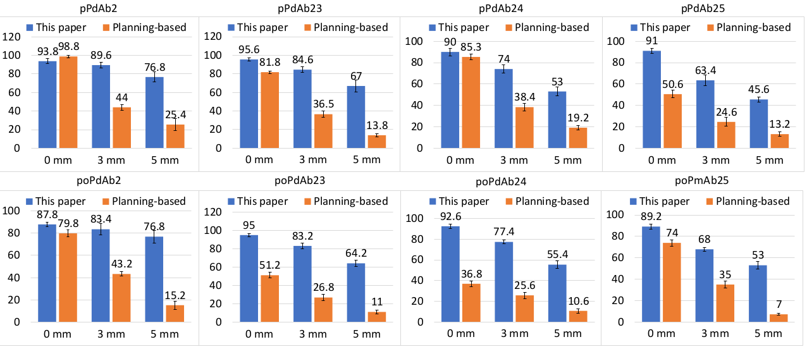

# Context-Aware-Task-Oriented-Grasping-with-Multistage-Reinforcement-Learning

### Concept ####
Perceive object features with multiple sensors attached to the robot arm. Task designations are represented as embeddings extracted from task instructions. Grasp topologies are generated based on object affordance and task designations with a grasp selection network. The predicted grasp topology is deployed adaptively using a multistage reinforcement learning approach.

### Framework ####
Human instructions are parsed with the Controlled Robot Language, and the "action" and "object" are extracted. The "object" identifies the target, and then the object affordances are gathered with the MagicHand Platform. The "action" is processed with word2Vec and embeded as 300 dimensional vector. A multi-label MLP network trained with the task-oriented grasping dataset is desigened to map object affordances and task designations to grasp topologies. The grasping task is decomposed into a series of consecutive sub-tasks and deployed with the multistage reinforcement learning model.

### Solving a Grasping Task ####

### Experiments ####

#### Dataset

Some example of the task-oriented grasping dataset used in this work is shown below

#### Grasp results in simulation environment

A total of 16,000 grasping tasks with eight grasp topologies on random unseen objects were proformed in the simulation. The accuracy average accuracy was 90.8%

Video1: https://user-images.githubusercontent.com/63925943/190689351-8aa4cd06-2cf9-4c75-aa5c-b1ce567b8d7e.MP4

Video2: https://user-images.githubusercontent.com/63925943/190689219-273b2330-0a52-4491-abc0-b3e3c41b3a93.MP4

#### Grasp results on Real Robot 

A total number of 320 grasping tasks were performed and the average success rate achieved 80.6%.

Video1: https://user-images.githubusercontent.com/63925943/190689595-aa72e9b2-5f8c-41cd-b417-52e4485ff609.mp4

Video2: https://user-images.githubusercontent.com/63925943/190689611-5fd3997b-cdef-4633-b31e-7492fbfa8e30.mp4

#### Comparsion results

The multistage grasp deplyment model is also compared with planning-based method and standard reinforcement learning, the comparsion results show that the proposed method outperforms the planning-based method and standard reinforcement learning in in accuracy, data efficiency, robustness, and generality.

##### Comparsion with Standard PPO

The multistage grasp deplyment model outperforms standard reinforcement model in accuracy, data efficiency, and converge time. 

##### Comparsion with Planning-Based Model

The multistage grasp deplyment model outperforms planning-based method under differenet errors model in accuracy, robustness, and generality. 

